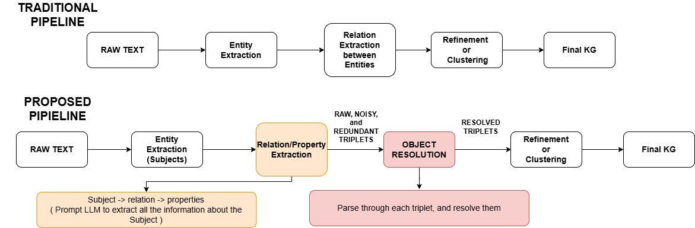

# HiReKG

**High-recall knowledge graph extraction from plain text with language models.**

HiReKG turns a document into a knowledge graph — a set of `(subject, relation, object)`
triples — and recovers substantially more of what the text actually says than existing
LLM-based extractors, without giving up much precision.

📄 [Read the paper](docs/HiReKG.pdf)

---

## The problem

Nearly every LLM-based text-to-KG system — KGGen, RAKG, GraphRAG, PiVe, iText2KG —
follows the same recipe. Extract a list of entities from the text, then ask the model
for relations **between pairs of those entities**. We call this the *entity-first*
pipeline.

Grounding relations against a fixed entity set is good for precision, but it quietly
throws information away in two ways:

- **An entity missed in step one is lost for good.** No relation involving it can ever
  be recovered downstream.
- **Facts about a single entity have nowhere to go.** "The Eiffel Tower is 330 metres
  tall" has no second entity to pair with, so it falls outside the relation-extraction
  step by construction.

The result is a systematic blind spot, concentrated precisely on facts that describe
one entity on its own.

## The idea

HiReKG keeps the entity-extraction step but stops using it as a cage. Instead of asking
for relations *between pairs*, it asks the model to surface **everything the text says
about each subject** — and lets the object be whatever it needs to be: a date, a
quantity, a descriptive phrase, or another entity.



That relaxation is what recovers the missing facts. But it creates a new problem: when
an object is a phrase like *"a tubular mouthpart called a proboscis"*, the entities
inside it stay trapped in a string instead of becoming nodes. The graph fragments into
disconnected per-subject stars.

## The pipeline

```
raw text → subject extraction → property extraction → object resolution → refinement → KG
```

| Stage | What it does |
|---|---|
| **Subject extraction** | Identify the entities in each chunk. These become the subjects to organise information around. |
| **Property extraction** | For each subject, gather everything the text says about it. Objects are unconstrained free-form phrases. |
| **Object resolution** | Promote entities buried inside object phrases into real graph nodes, reconnecting the graph. |
| **Refinement** | Canonicalise and cluster equivalent entities and relations. |

A full end-to-end trace on one paragraph — every intermediate output, stage by stage —
is in [`experiments/exp_1/`](experiments/exp_1/).

## Results

Evaluated across three datasets (general, scientific, and technical prose) and three
LLM backbones, against the two strongest entity-first baselines.

**Recall** — MINE Score, the share of ground-truth facts the graph supports:

| LLM | Method | MINE-1 | SciERC | Re-DocRED |
|---|---|---|---|---|
| GPT-4o | KGGen | 65.1 | 66.2 | 49.3 |
| | RAKG | 74.3 | 35.5 | 51.6 |
| | **HiReKG** | **93.4** | **81.7** | **80.3** |
| Qwen3-14B | KGGen | 58.9 | 53.9 | 46.6 |
| | RAKG | 61.3 | 45.6 | 54.7 |
| | **HiReKG** | **90.9** | **78.8** | **79.8** |
| Qwen3-8B | KGGen | 55.9 | 52.6 | 47.5 |
| | RAKG | 73.8 | 64.0 | 55.2 |
| | **HiReKG** | **83.4** | **68.1** | **64.1** |

HiReKG wins every cell, by 4 to 30 points.

**Where the gain comes from.** Splitting the ground-truth facts by how many entities
they mention shows the blind spot directly. Both baselines score consistently *worse*
on single-entity facts than on multi-entity ones — exactly what the entity-first design
predicts. HiReKG is close to symmetric:

| Method | Single-entity minus multi-entity, averaged over all nine configurations |
|---|---|
| KGGen | −7.4 |
| RAKG | −11.0 |
| **HiReKG** | **−2.4** |

Its absolute single-entity score beats the best baseline by 24 points on average, and by
as much as 43 on Re-DocRED, where the baselines collapse hardest. The advantage isn't a
generic uplift — it is concentrated on the facts the entity-first design cannot reach.

**The trade-off.** KGGen keeps the precision lead in every configuration — its strict
entity-pair anchoring is hard to beat on faithfulness. HiReKG trails it by 2–9 points
while recovering far more of the text, and beats RAKG on both axes at once. It also
produces less redundant graphs (unique-information ratio 0.71, against 0.68 for KGGen
and 0.59 for RAKG) at roughly 3× KGGen's token cost and under half of RAKG's.

Full precision, redundancy, cost, and variance tables are in the
[paper](docs/HiReKG.pdf); the numbers behind them are committed under
[`evaluation_pipeline/`](evaluation_pipeline/).

---

## Quick start

```bash
python -m venv .venv
# Windows:  .\.venv\Scripts\activate
# Linux:    source .venv/bin/activate

pip install -r requirements.txt
pip install kg-gen                      # upstream MINE retrieval routine
python -m spacy download en_core_web_sm
python our_approach/setup_nltk_models.py
```

Copy `.env.example` to `.env` and fill in your API keys, or point `LOCAL_LLM_URL` at an
OpenAI-compatible endpoint (we used vLLM) to run entirely on open-weight models.

Then extract graphs for a directory of `.txt` files:

```bash
python our_approach/run_mine_batch.py --texts-dir datasets/MINE/texts
```

Runners are resumable — rerunning skips any document that already has a
`final_output.json`. [`run_all_batches.ps1`](run_all_batches.ps1) runs HiReKG and both
baselines back to back against one endpoint.

## What's in here

| Path | |
|---|---|
| [`our_approach/`](our_approach/) | The HiReKG pipeline. [`object_resolution.py`](our_approach/object_resolution.py) is the core contribution; [`prompts.py`](our_approach/prompts.py) holds every prompt. |
| [`baselines/`](baselines/) | KGGen and RAKG, rebuilt on the same LLM client so comparisons isolate pipeline design rather than model access. |
| [`datasets/`](datasets/) | MINE-1, SciERC, and the Re-DocRED subset — source texts, gold triples, and atomic facts. |
| [`evaluation_pipeline/`](evaluation_pipeline/) | MINE Score (recall), Faithfulness (precision), unique-information ratio, object-resolution statistics, token accounting. |
| [`fact_generation/`](fact_generation/) | The atomic-fact generation and single/multi-entity classification behind the recall ground truth. |
| [`experiments/exp_1/`](experiments/exp_1/) | The worked end-to-end trace. |
| [`scripts/`](scripts/), [`results/`](results/) | Label validation and figures. |

### Reproducing the evaluation

Each metric has its own runner:

```bash
python evaluation_pipeline/mine_score/run_mine_evaluation.py       # recall
python evaluation_pipeline/faithfulness/run_faithfulness.py        # precision
python evaluation_pipeline/structural/run_uir_evaluation.py        # redundancy
```

Aggregated results — every number reported in the paper — are committed alongside the
code and need no download. The **per-document** raw outputs (extracted graphs and
per-triple judge verdicts, ~20,000 files) are published on the
[releases page](../../releases) as four archives: `hirekg-ours`, `hirekg-baselines`,
`hirekg-evaluation`, and `hirekg-experiments-all`. Each stores paths relative to the
repository root, so unzipping restores the expected layout in place:

```bash
unzip hirekg-experiments-all.zip -d .
```

You only need them to re-run the evaluators or inspect individual documents.

## Notes on the setup

Extraction used `gpt-4o-2024-08-06`, `Qwen3-14B-FP8`, and `Qwen3-8B-FP8`. To avoid
same-model bias, judging is tier-matched and held fixed across all three methods: GPT-5
judges the GPT-4o graphs, Qwen3-32B judges both Qwen runs. The Qwen models were served
locally with vLLM. Chunking follows each published pipeline rather than being normalised
across methods.

## License

MIT — see [LICENSE](LICENSE).

Third-party artifacts keep their own terms:

- [kg-gen](https://github.com/stair-lab/kg-gen) — MIT (declared in its `pyproject.toml`)
- [RAKG](https://github.com/KnowledgeXLab/RAKG) — MIT
- [Re-DocRED](https://github.com/tonytan48/Re-DocRED) and
  [DocRED](https://github.com/thunlp/DocRED) — MIT
- [SciERC](http://nlp.cs.washington.edu/sciIE/) and the MINE-1 benchmark
  ([essays](https://huggingface.co/datasets/kyssen/kg-gen-evaluation-essays),
  [answers](https://huggingface.co/datasets/kyssen/kg-gen-evaluation-answers)) — no
  license is declared at source. They are redistributed here for research
  reproducibility; check with the original authors before any other use.

The upstream RAKG and kg-gen repositories are referenced rather than vendored; see
[`baselines/rakg/howtouse.md`](baselines/rakg/howtouse.md) and
[`baselines/kggen/howtouse.md`](baselines/kggen/howtouse.md).
